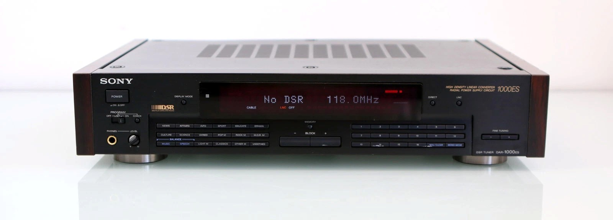

# DAR-1000ES Conversion

The Sony DAR-1000ES is an old relic that used to be a satellite tuner. Its front panel has a number of buttons that we can reuse, its output is digital and internally it even has its own DAC (Digital Analog Conversion) chip.



[Piotr D. on YouTube](https://youtu.be/dSmdoRHq8-w?si=nIIm9IDE0pOxPFWs) for example managed to convert it already. However, for his conversion he replaced the entire display, used his own DA conversion and picked up at the analog stage of the old unit (from what I can see in the pictures). In this conversion I will be attempting to use as much as possible from the original unit, including the DAC, the analog amplifiers, the display, the buttons and powersupply.

# Design Objectives and Project Philosophy

## Project Vision

The objective of this project is not simply to convert a Sony DAR-1000ES satellite tuner into an Internet radio receiver. The goal is to preserve and extend a piece of high-end Sony ES hardware while integrating modern streaming capabilities.

Many conversions replace most of the original electronics and reuse only the chassis. This project follows the opposite approach. Wherever practical, the original hardware should remain operational and continue performing the functions for which it was originally designed.

The DAR-1000ES contains a number of high-quality subsystems that remain perfectly usable despite the obsolescence of the satellite reception technology:

- Front panel controls
- Vacuum Fluorescent Display (VFD)
- Digital audio circuitry
- Sony digital filter
- Sony DAC
- Analogue output stages
- Power supply
- Mechanical construction

The conversion therefore focuses on replacing only the source and control logic while preserving the remaining signal path.

---

## Why This Receiver?

The DAR-1000ES is uniquely suited for conversion into an Internet radio streamer.

Unlike many audio products that provide only a small number of generic controls, the DAR-1000ES contains a rich collection of front-panel buttons originally intended for programme-type selection. These controls map naturally onto modern Internet radio concepts such as genres, categories, countries and presets.

The receiver also contains:

- A large high-quality VFD display
- Dedicated tuning controls
- Multiple memory buttons
- Premium ES-series analogue electronics
- A robust power supply
- Significant internal space for new electronics

Taken together, these characteristics create a platform that can be modernised while remaining visually and operationally faithful to the original Sony design.

---

## Core Design Principles

The project is guided by several fundamental principles.

### 1. Maximum Hardware Preservation

Original Sony hardware should remain in service whenever technically feasible.

Preference order:

1. Reuse existing hardware unchanged
2. Interface with existing hardware
3. Emulate original hardware behaviour
4. Replace hardware only when absolutely necessary

This philosophy minimizes modifications while preserving the character of the original receiver.

The goal is not to build a new streamer inside an old box. The goal is to extend the life of the original receiver.

---

### 2. Reversible Modifications

Modifications should be reversible whenever practical.

Examples include:

- Using existing test points for measurements
- Reusing original resistor locations as signal injection points
- Avoiding unnecessary PCB cuts
- Capturing original control signals before modifications
- Preserving removed components where they could influence experience or sound

---

### 3. Original User Experience

The receiver should continue to feel like a radio.

The user interface philosophy is based on preserving the operational experience created by Sony rather than replacing it with a smartphone-inspired interface.

The original buttons:

- NEWS
- AFFAIRS
- INFO
- SPORT
- SCIENCE
- POP M
- ROCK M
- CLASSICS

already provide an excellent method of browsing radio content. So, instead of navigating folders and menus, users browse radio stations in a way that feels natural and familiar.

---

### 4. Preserve the Sony Audio Path

Audio quality is one of the defining characteristics of ES-series equipment. The preferred signal path therefore remains:

```text
ESP32 Network Stream
          │
          ▼
Sony CXD2560M Digital Filter
          │
          ▼
Sony CXD2562Q DAC
          │
          ▼
Original Analog Output Stage
          │
          ▼
Line Output
```

By retaining this path, the project preserves:

- Sony digital filtering
- Sony D/A conversion
- Sony analogue filtering
- Original muting circuits
- Original output amplifiers

The analogue sound character of the receiver should remain fundamentally unchanged.

---

### 5. Authentic Display Integration

The VFD display is one of the most distinctive features of the DAR-1000ES and we want to preserve it. We will figure out the special elements of the display after we get full text working.

Project objectives include:

- Reusing the original display glass
- Reusing the original display driver devices
- Preserving the original brightness characteristics
- Preserving original indicators and icons
- Preserving Sony display aesthetics

The display should not merely show text, it's the extension of the original Sony user interface philosophy.

---

### 6. Modern Streaming Functionality

While preserving the appearance and behaviour of the original unit, functionality should be fully modern.

Target capabilities include:

- Internet radio playback
- Worldwide station directory
- Country selection
- Genre filtering
- Sub-category selection
- Preset storage
- Metadata display
- Stream information display
- Non-volatile settings storage
- AirPlay supportability

The unit should be able to provide access to thousands of radio stations despite appearing externally almost unchanged.

---


### 7. Non-Destructive Development

Development should proceed using the least intrusive methods possible.

The preferred order of investigation is:

1. Documentation review
2. Signal measurement
3. Logic analysis
4. Temporary wiring
5. Reversible modifications
6. Permanent modifications

---

## Technical Objectives

The project must achieve several technical goals.

### Display System

- Fully control the VFD display
- Reuse IC702 and IC703 display drivers
- Emulate original IC701 functionality
- Support dynamic display updates
- Maintain smooth refresh behaviour

### Input System

- Capture all front-panel button presses
- Use a TCA8418 keypad controller
- Preserve original button behaviour
- Support future firmware extensions

### Audio System

- Stream digital audio from the ESP32
- Feed the original Sony digital audio chain
- Preserve analogue output quality
- Maintain low-noise operation
- Support future audio enhancements

### Software

- Reliable Internet-radio playback
- Fast startup
- Persistent settings storage
- Expandable architecture
- OTA firmware update capability (future)

---


