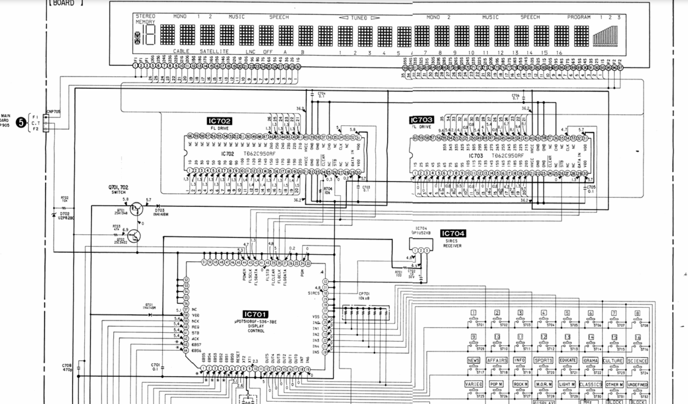
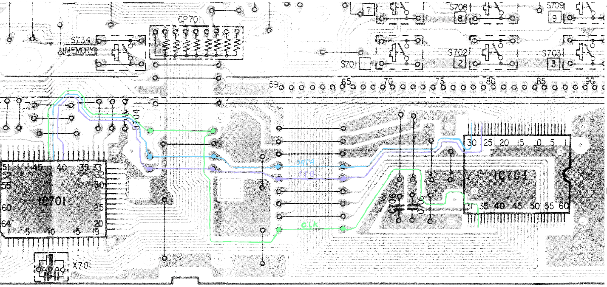
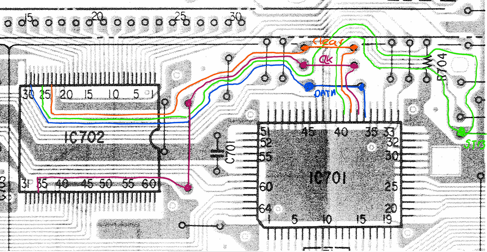

# DAR-1000ES Display Control

Internet-radio user interface, display drivers and logic 

The display in the 1000ES is driven by a central proprietary SONY chip (IC701) that sends commands to two display driver chips. The display itself is a VFD (vacuum fluorescent display). More info on those on Youtube: https://youtu.be/gZIRPJt69sM?si=HwfT3PWyx6F6qvj4

While others have used “new” VFD’s and drivers, I was wondering if I can reuse the existing driver chips, IC702 and IC703 which are “common” TD62C950RF chips that run on regular 40 bits signal inputs. IC702 seems to drive the Grid, while IC703 runs the individual segments. Each chip has separate inputs that come straight from the main controller IC701:

- FLGDATA

- FLGCLK

- FLCLEAR

- FLSTB (shared)

- FLSDATA

- FLSCLK

<figure>

<figcaption>
Figure 1: Schematic for the display
</figcaption>
</figure>

Given the spec sheet on the drivers, we should be able to control the inputs (semi) directly with an ESP32 (depending on if these chips require 5v or 3.3v inputs for the data signals). At first glance they look complex, but they are actually quite simple. The TD62C950RF is essentially a **40-bit serial shift register with high-voltage outputs**. Think of it as a device that converts a serial stream of bits into 40 individual output pins based on a few inputs:

1.  DATA Serial data input (SONY: FLSDATA / FLGDATA)

2.  CLOCK Shift clock (SONY: FLSCLK / FLGCLK)

3.  STB Strobe/Latch (SONY: FLSTB)

4.  CLEAR Clear all stored bits (SONY: FLCLEAR)

The way that data is loaded is by the combination of the DATA input and the clock input. On clock 0 we can send a 1 on the data port, resulting in: 1000000000000000000000000000000000000000

If we can tick the clock again, everything shifts to the right, if we send another 0 now, we get 0100000000000000000000000000000000000000

Once we have all 40 sections loaded (or even partially), we can activate the outputs (and thus the display fields). Only when the STB (strobe) signal is pulsed does the chip copy the stored data to its output pins. In the above, only pin 2 will become active. Clear effectively sets the entire register to 0.

So, the idea is simple, check what control signals are sent from IC701 to the display (for example at startup). Capture those, revert the engineering and replace IC701 with something we can program ourselves, an ESP32.

## Analyzing the signals

To analyze the signals, I got myself a Binghe 8CH 24MHz USB Logic Analyzer. The idea is to hook into the above mentioned data pins and try to capture the signals. We don’t have to solder just yet, it seems that the existing PCB layout allows us to tap into these signals easily through the bridges present:

For IC703, the 3 channels (DATA, STB, CLK) are on the bridge as per above (top-bottom).

- DATA (pin 29)

- STB (pin 26) (shared)

- CLK (pin 34)

- CLEAR

IC702 has similar paths but closer to IC701

- CLEAR (pin 24)

- CLOCK (pin 34)

- DATA (pin 29)

- STB (pin 26) (shared)

The hypothesis is that we see something like

> 40 bits to segment driver  
> 40 bits to grid driver  
> Latch
>
> 40 bits to segment driver  
> 40 bits to grid driver  
> Latch
>
> 40 bits to segment driver  
> 40 bits to grid driver  
> Latch

Once we figure that out, I can make a recording of the screen, capture the data from the inputs, try to synchronize them, and feed them to an AI to figure out the patterns.

## ESP Connections
The ESP32 has several connections that are going to be used by the display drivers as well as the I2S and keyboard inputs:

**IC702 (Grid Driver)**

------------------

GPIO 4   -\> FLGDATA

GPIO 5   -\> FLGCLK

GPIO 6 -\> FLGCLEAR

**IC703 (Segment Driver)**

----------------------

GPIO 7   -\> FLSDATA

GPIO 8   -\> FLSCLK

**Shared**

------

GPIO 9   -\> FLSTB

**IC501 Control**

-------------

GPIO10  -\> ATT

GPIO11  -\> SHIFT

GPIO12  -\> LATCH

GPIO13  -\> INIT

**I2S Audio**

---------

GPIO16  -\> BCK

GPIO17  -\> LRCK

GPIO18  -\> DATA

GPIO21  -\> MCLK

**Keyboard (TCA8418)**

------------------

GPIO1   -\> SDA

GPIO2   -\> SCL

Ground connected

**  
**
