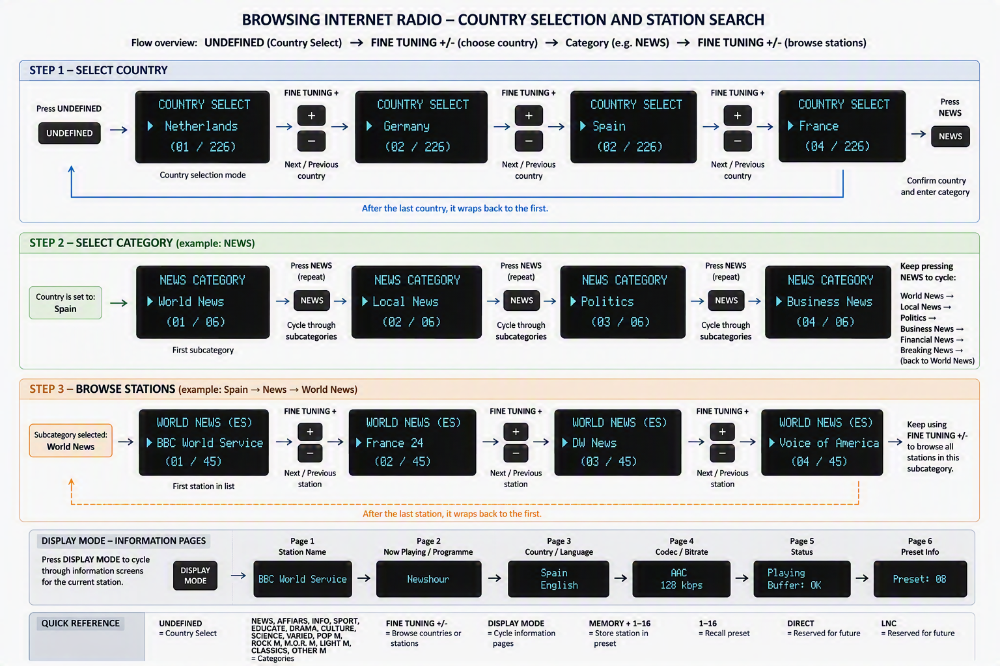

# DAR-1000ES Program and Keypad Baseline

Internet-radio user interface, keypad wiring and application logic 

This chapter is the baseline for the ESP32 software. It defines how the original Sony front panel is connected through the TCA8418, how each control behaves, and how internet-radio stations are selected and played. 

 

**1. Design principle **

The converted DAR-1000ES should continue to feel like a radio receiver. The original programme-type buttons remain programme categories, while the tuning and memory controls become navigation, filtering and preset controls. The display should expose only the information needed for the current action. 

- Preserve the meaning of the original front-panel labels wherever possible. 

<!-- -->

- Use short presses for the primary action; reserve long presses only for secondary functions that cannot be expressed otherwise. 

<!-- -->

- Keep playback running while the user opens information or filter screens. 

<!-- -->

- Store the last country, category and station so the tuner returns to the previous state after restart. 

**2. Keypad hardware connection **

The keypad schematic shows the switch matrix connected to IC701, the original display controller. The relevant controller net names are OUT0 to OUT5 and IN0 to IN7. These fourteen lines are reused for the TCA8418.

**Connection rule  **Disconnect or remove IC701 from the twelve keypad-matrix lines before the TCA8418 drives them. Do not leave both IC701 and the TCA8418 connected as active matrix scanners. 

 

| **Original keypad net**  | **TCA8418 connection**  | **Purpose**          |
|--------------------------|-------------------------|----------------------|
| IC701 OUT0               | ROW0                    | Matrix drive line 0  |
| IC701 OUT1               | ROW1                    | Matrix drive line 1  |
| IC701 OUT2               | ROW2                    | Matrix drive line 2  |
| IC701 OUT3               | ROW3                    | Matrix drive line 3  |
| IC701 OUT4               | ROW4                    | Matrix drive line 4  |
| IC701 OUT5               | ROW5                    | Matrix drive line 5  |
| IC701 IN0                | COL0                    | Matrix sense line 0  |
| IC701 IN1                | COL1                    | Matrix sense line 1  |
| IC701 IN2                | COL2                    | Matrix sense line 2  |
| IC701 IN3                | COL3                    | Matrix sense line 3  |
| IC701 IN4                | COL4                    | Matrix sense line 4  |
| IC701 IN5                | COL5                    | Matrix sense line 5  |
| IC701 IN6                | COL6                    | Matrix sense line 6  |
| IC701 IN7                | COL7                    | Matrix sense line 7  |

 

The TCA8418 is connected to the ESP32 over I²C: 

> ESP32 GPIO1  -\> TCA8418 SDA   
> ESP32 GPIO2  -\> TCA8418 SCL   
> ESP32 GND    -\> TCA8418 GND   
> TCA8418 INT  -\> spare ESP32 GPIO (recommended) 

The fourteen matrix nets above provide a 6 × 8 matrix capacity, for up to 48 key positions. The schematic also shows additional controls outside the main programme-type group, including the tuning-board inputs. Their exact row/column key codes must be verified with continuity testing or a keypad scan after connection. The software should therefore initially log raw row/column events before assigning every physical key. 

## Browsing and Selecting Internet Radio Stations

The DAR-1000ES Internet Radio firmware is designed around the original Sony front-panel layout. Instead of transforming the unit into a generic streaming device, the original controls retain their radio-oriented workflow. The three-row programme-type button block becomes the primary content selection area, while the remaining controls are used for navigation, metadata display, country selection and preset management.

The goal is to preserve the experience of browsing radio content rather than browsing a library of stations.

## Design Philosophy

The user experience follows a simple and predictable sequence:

1.  Select a source country.

2.  Select a content category.

3.  Select a subcategory.

4.  Browse available stations.

5.  View stream information.

6.  Save favorite stations as preset (optional).

This approach preserves the original DAR-1000ES operating style while providing access to thousands of Internet radio stations organised by country, category and subcategory.

## Category Selection

The entire programme-type key block is used for station categories.

> NEWS
>
> AFFAIRS
>
> INFO
>
> SPORT
>
> EDUCATE
>
> DRAMA
>
> CULTURE
>
> SCIENCE
>
> VARIED
>
> POP M
>
> ROCK M
>
> M.O.R. M
>
> LIGHT M
>
> CLASSICS
>
> OTHER M
>
> UNDEFINED

Each button represents a top-level station category.

Examples:

> NEWS -\> News stations
>
> SPORT -\> Sports stations
>
> SCIENCE -\> Science and Technology
>
> POP M -\> Pop Music
>
> ROCK M -\> Rock Music
>
> CLASSICS -\> Classical Music

When a category button is pressed, the firmware opens the first available subcategory.

Example:

> NEWS
>
> ↓
>
> World News
>
> \`\`

Repeated presses of the same category button cycle through all available subcategories. The list wraps around continuously.

Example:

> NEWS
>
> ↓
>
> World News
>
> ↓
>
> Local News
>
> ↓
>
> Politics
>
> ↓
>
> Business News
>
> ↓
>
> Financial News
>
> ↓
>
> Breaking News
>
> ↓
>
> World News
>
> ↓
>
> \`\`\`\`\`

## Country Selection

The **UNDEFINED** button is repurposed as the Country Selection key.

Press:

UNDEFINED

to enter Country Selection mode.

Use:

> FINE TUNING -
>
> FINE TUNING +

to browse through the available countries.

> Netherlands
>
> Germany
>
> Spain
>
> France
>
> United Kingdom
>
> United States
>
> \`\`\`\`\`

The selected country remains active as a global filter.

> Country = Spain
>
> Category = NEWS

Results in Spanish News Stations

Once the desired country is displayed, pressing any category button immediately enters that category within the selected country.

**Block Navigation**

The **BLOCK -** and **BLOCK +** controls provide accelerated navigation through long station lists.

> BLOCK -
>
> BLOCK +

moves backward/forward 10 stations, sub-genres, or countries.

Functionally this is equivalent to:

> BLOCK + = FINE TUNING + pressed 10 times
>
> BLOCK - = FINE TUNING - pressed 10 times

Example:

> Current Station = \#25
>
> BLOCK +
>
> New Station = \#35

This allows rapid movement through large lists without repeatedly pressing the FINE TUNING controls.

## Browsing Stations

After a category and subcategory have been selected, the firmware builds a list of matching stations.

Example:

> Country = Spain
>
> Category = NEWS
>
> Subcategory = World News

Available stations:

> BBC World Service
>
> DW News
>
> France 24
>
> Voice of America
>
> Radio Canada International

Use:

> FINE TUNING -
>
> FINE TUNING +

To get to the radio station:

> BBC World Service
>
> ↓
>
> DW News
>
> ↓
>
> France 24
>
> ↓
>
> Voice of America

The currently selected station becomes the active station.

## Display Mode

The **DISPLAY MODE** button cycles through information pages relating to the currently selected station.

> Country Filter  
> Station Name
>
> Current Programme
>
> Country and Language
>
> Stream Information
>
> Preset Information

## Presets

The sixteen numeric buttons continue to function as direct station presets.

**Store a Preset**

While listening to a station:

> MEMORY
>
> 8

stores the current station into preset 8.

## Reserved Controls

The following controls are retained for future functionality:

> DIRECT
>
> LNC
>
> MONO MODE
>
> BALANCE MUSIC
>
> BALANCE SPEECH

These controls generate firmware events but do not yet have a defined function in the baseline design.

Possible future uses include:

> DIRECT = Quick navigation
>
> LNC = Favourites
>
> BLOCK +/- = Fast navigation
>
> MONO MODE = Playback options

